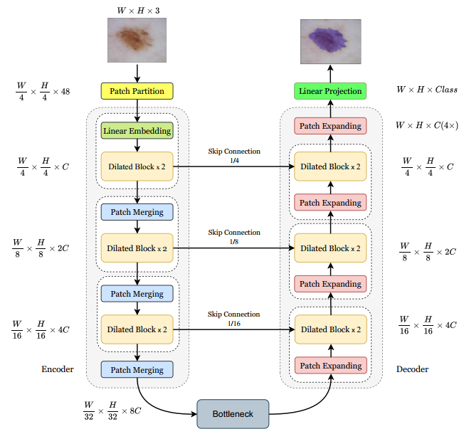

# Dilated-UNet: A Fast and Accurate Medical Image Segmentation

This paper introduces DilatedUNet, which combines a Dilated Transformer block with
the U-Net architecture for accurate and fast medical image segmentation. Image patches are transformed into tokens and fed into the U-shaped encoder-decoder architecture, with skip-connections for local-global semantic feature learning. The encoder uses a hierarchical Dilated
Transformer with a combination of Neighborhood Attention
and Dilated Neighborhood Attention Transformer to extract
local and sparse global attention

## Overview

<div style="text-align: center">

</div>
Figure 1. The overall architecture of Dilated-Unet.</center>

## References
* [Swin-Unet](https://github.com/HuCaoFighting/Swin-Unet/blob/main/README.md)
* [Neighborhood Attention Transformers](https://github.com/SHI-Labs/Neighborhood-Attention-Transformer)

## Citation

```bibtex
@article{saadati2023dilated,
  title={Dilated-UNet: A Fast and Accurate Medical Image Segmentation Approach using a Dilated Transformer and U-Net Architecture},
  author={Saadati, Davoud and Manzari, Omid Nejati and Mirzakuchaki, Sattar},
  journal={arXiv preprint arXiv:2304.11450},
  year={2023}
}

```
